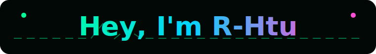
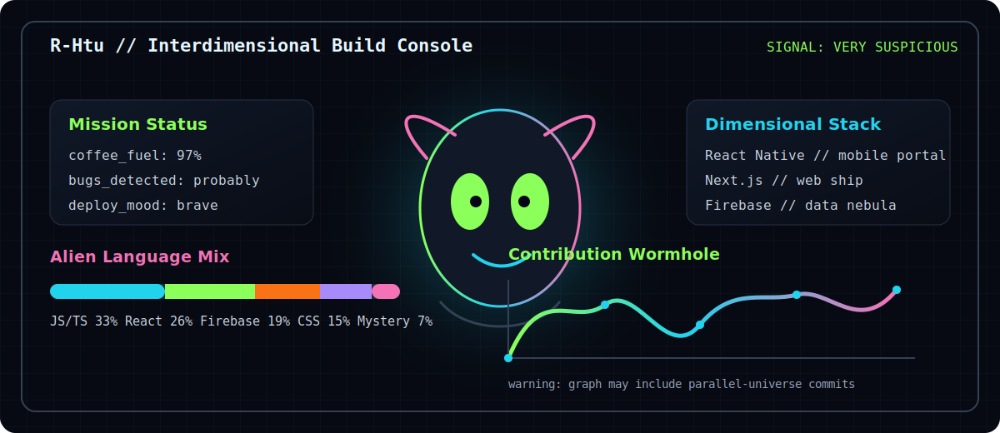

<p align="center">
  
</p>

<p align="center">
  
</p>

<p align="center">
  <b>Full-Stack Developer</b> | <b>Creative Designer</b> | <b>Forever Learner</b>
</p>

<p align="center">
  I build clean, useful apps with thoughtful UX, strange ideas, and code that usually behaves after enough snacks.
</p>

<p align="center">
  <a href="https://github.com/R-Htu">
    
  </a>
  <a href="https://www.youtube.com/@the_dumb_traveler">
    
  </a>
  <a href="mailto:htuaung89@gmail.com">
    
  </a>
</p>

---

## whoami

```rust
fn main() {
    let me = Human {
        name: "R-Htu",
        role: ["Full-Stack Developer", "Creative Designer", "Forever learner"],
        status: "broadcasting from a suspiciously green dimension",
        superpower: "turning weird ideas into working interfaces",
        currently_learning: ["React Native", "Next.js", "Node.js", "Databases", "Cloud"],
        open_to: ["collaboration", "freelance", "open source"],
        daily_bug_report: "the bug was me, but I fixed me",
    };

    while me.is_awake() {
        me.design();
        me.code();
        me.break_reality_a_little();
        me.ship();
    }
}
```

---

## Tech Stack

<p>
  
</p>

---

## Featured Projects

<table>
  <tr>
    <td width="50%">
      <h3 align="center">EchoChat</h3>
      <p align="center">
        <a href="https://echochat-five.vercel.app/">
          
        </a>
      </p>
      <p align="center">A real-time chat app built for fast, clean conversation and a smooth web experience.</p>
    </td>
    <td width="50%">
      <h3 align="center">Firestore Lesson</h3>
      <p align="center">
        <a href="https://firestore-lesson-one.vercel.app/">
          
        </a>
      </p>
      <p align="center">A Firebase/Firestore learning project focused on storing, reading, and working with live app data.</p>
    </td>
  </tr>
</table>

---

## Alien Control Room

<p align="center">
  
</p>

> Transmission received: I came from another dimension to write bugs in this one.

---

## GitHub Activity

<table>
  <tr>
    <td width="33%" align="center">
      <b>Building</b><br />
      Full-stack apps, creative interfaces, and Firebase experiments.
    </td>
    <td width="33%" align="center">
      <b>Learning</b><br />
      React Native, Next.js, Node.js, databases, and cloud deployment.
    </td>
    <td width="33%" align="center">
      <b>Shipping</b><br />
      Small projects, real demos, and cleaner code every week.
    </td>
  </tr>
</table>

<p align="center">
  <a href="https://github.com/R-Htu?tab=repositories">
    
  </a>
</p>

---

## Current Focus

- Building production-ready web apps
- Designing better interfaces and smoother user experiences
- Learning cloud deployment and CI/CD
- Contributing to open-source projects

---

## Contact

<p align="center">
  <b>Let's build something useful, weird, and alive.</b>
</p>

<p align="center">
  <a href="mailto:htuaung89@gmail.com">Email</a> |
  <a href="https://www.youtube.com/@the_dumb_traveler">YouTube</a> |
  <a href="https://github.com/R-Htu">GitHub</a>
</p>
