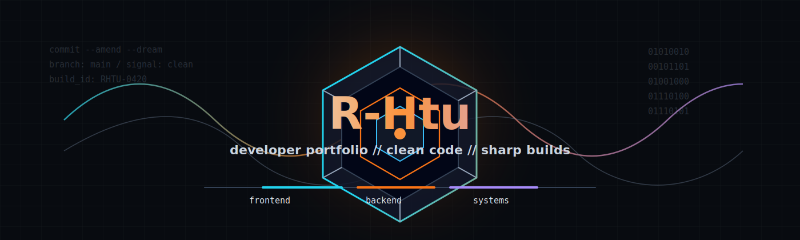

<p align="center">
  
</p>

<h1 align="center">Hey, I'm R-Htu 👋</h1>

<p align="center">
  <b>Full-Stack Developer</b> • <b>Backend Builder</b> • <b>Creative Problem Solver</b>
</p>

<p align="center">
  I build clean, scalable apps with thoughtful UX, reliable APIs, and code that is easy to maintain.
</p>

<p align="center">
  <a href="https://github.com/R-Htu">
    
  </a>
  <a href="https://www.linkedin.com/">
    
  </a>
  <a href="mailto:your-email@example.com">
    
  </a>
</p>

---

## ✦ whoami

```rust
fn main() {
    let me = Developer {
        name: "R-Htu",
        role: ["Full-Stack Developer", "Backend Developer"],
        focus: "clean systems, useful products, and fast learning",
        currently_learning: ["React", "Node.js", "Databases", "Cloud"],
        open_to: ["collaboration", "internships", "freelance", "open source"],
    };
}
```

---

## 🧰 Tech Stack

<p>
  
</p>

---

## 🚀 Featured Projects

<table>
  <tr>
    <td width="50%">
      <h3 align="center">Project One</h3>
      <p align="center">
        <a href="https://github.com/R-Htu">
          
        </a>
      </p>
      <p align="center">My GitHub profile portfolio, built to show skills, projects, and current focus.</p>
    </td>
    <td width="50%">
      <h3 align="center">Project Two</h3>
      <p align="center">
        <a href="https://github.com/R-Htu?tab=repositories">
          
        </a>
      </p>
      <p align="center">More projects will appear here as I build and publish new work.</p>
    </td>
  </tr>
</table>

---

## 📊 GitHub Activity

<p align="center">
  
  
</p>

<p align="center">
  
</p>

---

## ⚡ Current Focus

- Building production-ready web apps
- Improving backend architecture and database design
- Learning cloud deployment and CI/CD
- Contributing to open-source projects

---

## 📫 Contact

<p align="center">
  <b>Let's build something useful.</b>
</p>

<p align="center">
  <a href="mailto:your-email@example.com">Email</a> •
  <a href="https://www.linkedin.com/">LinkedIn</a> •
  <a href="https://github.com/R-Htu">GitHub</a>
</p>
